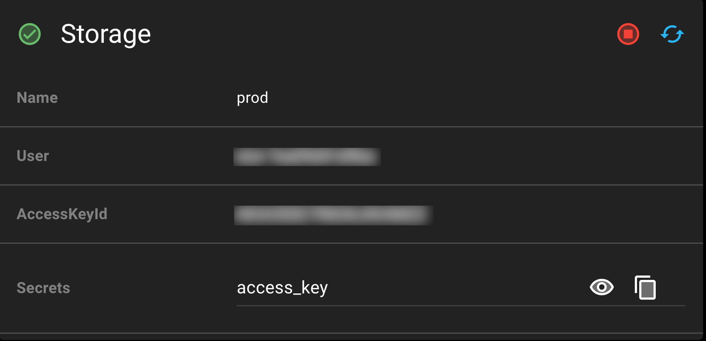
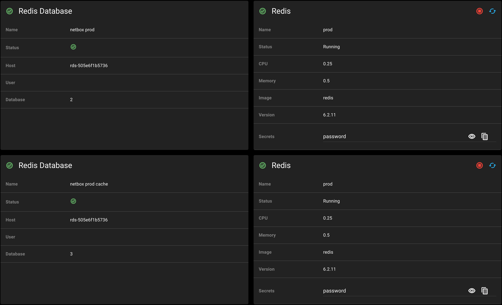
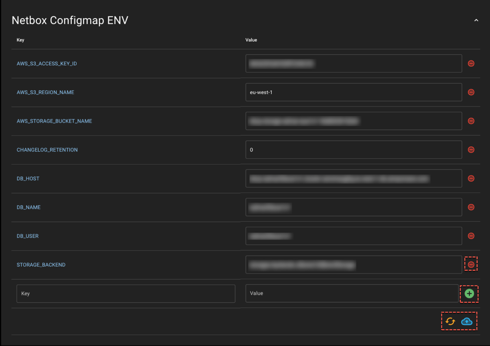

# NetBox Cloud: Administrative Console Overview

## Summary View
This compressed full page screenshot breaks the full Administrative Console down into similar sections.  Each section is designed to give you greater insight to your NetBox instance.

## Section Breakdown

### 1. Information Panel

The Information Panel provides a view of basic information relating to your NetBox Cloud instance.  Here you will find the name of your NetBox Cloud instance within your Organization's Namespace, along with the AWS Region and the NetBox version. You also have a link to the instance raw URL, plus a refresh button for the instance data. 

### 2. NetBox Deployment 

The NetBox Deployment panel lists various service and configuration status points.  Included will be the current version, and version upgrade controls, the number of instance replicas, and resource allocations. The instance image and namespace are also listed here.  

- The left circle icon (stop button) will stop the running NetBox Cloud instance.
- The center circle icon (play button) will start the NetBox Cloud instance.
- The right refresh icon will refresh the data in the panel. 
- The Version number with the smaller font displays the current NetBox version
- The Version drop down lists versions of NetBox that can be changed to.
- The cloud icon will illuminate if you select a different version of NetBox.
- The cloud icon will change NetBox to the selected version.

The Secrets section provides access to the current secret credentials for the instance API Token, local “admin” user account and Secret Key.  When the Administrative Console initially loads these values will be hidden.  

- Clicking the open eye will reveal the secret details
- Clicking the closed eye will conceal the secret details
- Clicking the copy icon will copy the secret to your clipboard

### 3. Ingress

The Ingress pannel gives the Name, Domain and DNS Name information for the NetBox Cloud instance, as well as the number of Ingress Pods and the Load Balancer status.

### 4. Storage

The Storage Panel contains information on the storage bucket, user, and access key ID. Clicking the open eye will reveal the Access Key secret details.

### 5. Postgres

The Postgres Database panel (left) gives the current status of the database, along with details of the host, username and database name for the instance. Clicking the open eye will reveal the Postrges Database secret details.

The Postgres panel (right) gives the number of database instances, their status, instance names, version, Aurora capacity unit consumption, current configured backup retention period, and security group IDs. Clicking the open eye will reveal the Postrges secret details.

### 6. Redis

The Redis Database panel (left) gives the name, status, host, user, and ID of the Main and Cache Redis databases. 

The Redis panel (right) gives the name, status, resource, image and version information for the Redis instance. Clicking the open eye will reveal the Redis secret details.

### 7. Advanced Configuration

#### 7b. Ingress Allow List

If the Ingress Allow List is configured, then inbound Web/API traffic will only be permitted to either IPv4 or IPv6 CIDR ranges listed on the Ingress Allow List. 

#### 7c. NetBox Configmap ENV

This NetBox Configmap ENV allows you to view or manage the underlying variables for the instance

#### 7d. NetBox Startup Configmaps

The NetBox Startup Configmaps (redacted screenshot) allows you to view or manage the underlying configmaps for the instance.

### 8. Pod Info/Logs

The Pods screen allows you to view the underlying composition of the instance.  This includes versions, operational status, vCPU and Memory information.

- The refresh button will give you the up-to-date information for all pods.
- The multi line icon will load the current log for the selected object in each pod.
