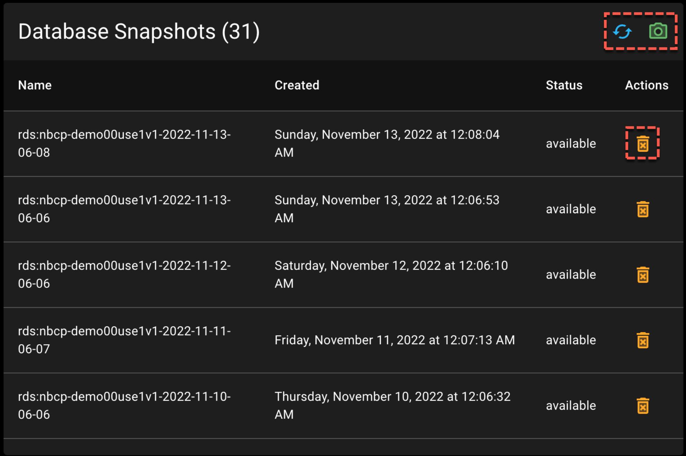
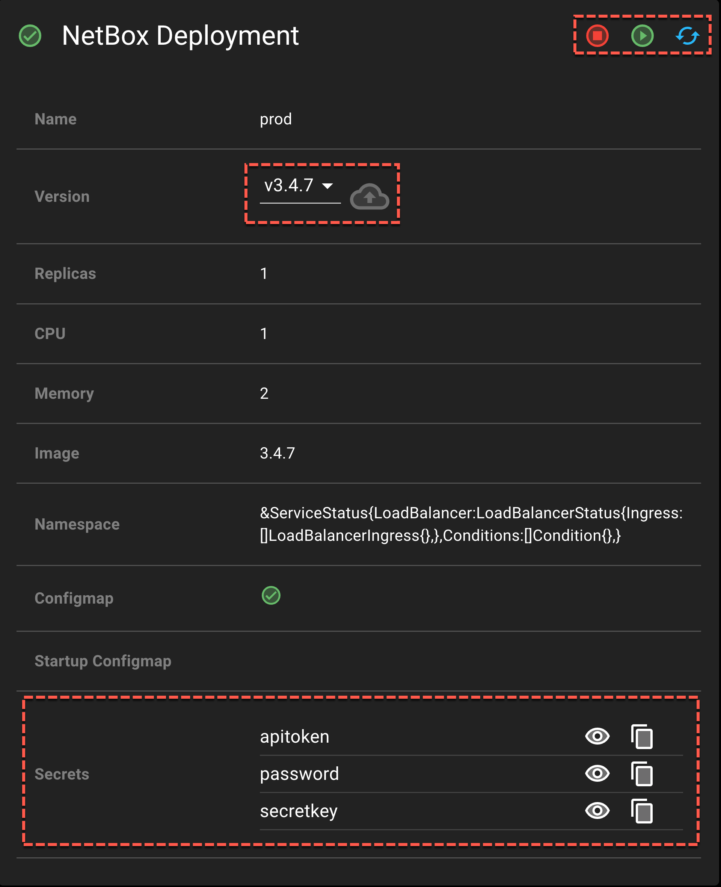
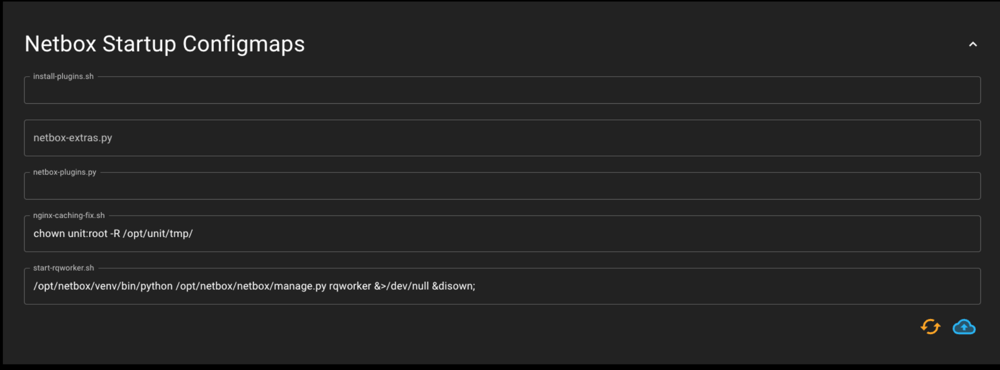
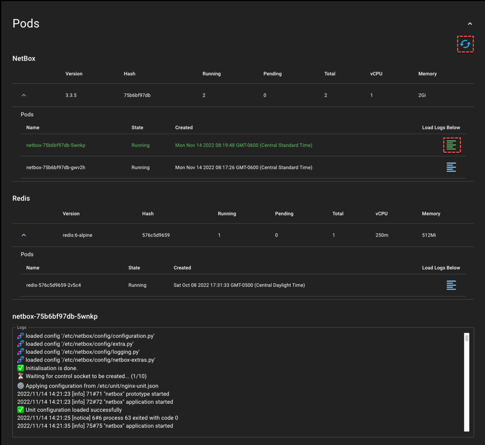

# NetBox Cloud: Administrative Console Overview

## Summary View
This compressed full page screenshot breaks the full Administrative Console down into similar sections.  Each section is designed to give you greater insight to your NetBox instance.

## Section Breakdown

### 1. Information Panel

The Information Panel provides a summary view of your NetBox Cloud instance.  Here you will find the instance raw URL, a running count of objects grouped by category, and the status of the major services in your NetBox Cloud instance.  Highly Available instances will contain at least 2 Databases and Load Balancers.

### 2. Secrets

The Secrets Panel provides access to the current secret credentials for the instance local “admin”, API Token, and DB Password.  When the Administrative Console initially loads these values will be hidden.  

- Clicking the open eye will reveal the secret details
- Clicking the closed eye will conceal the secret details

### 3. Database

The Database Panel gives the current state of the database configuration for the instance, the number of permitted databases for the instance, their sync status, version, AWS host, Aurora capacity unity consumption and configuration, current configured backup retention period, and security group IDs.

### 4. Storage

The Storage Panel contains information on the storage bucket, user, and access key ID.  

### 5. Database Snapshots

The Database Snapshots Panel lists all of the snapshots as they exist in storage.  Each snapshot will contain a composite file name to help distinguish snapshots from each other.

- The double arrow refresh button fetches the current list of snapshots
- The camera icon creates a new snapshot
- The trash can icon deletes the selected snapshot

### 6. Deployment 

The Deployment Panel lists various service and configuration status points.  Included will be the number of allowed instances, current version, and version upgrade controls.  The instance namespace is also listed here.  A status indicator is also displayed for all of the required underlying NetBox Cloud deployment services.

- The left circle icon (stop button) will stop all running NetBox Cloud instances.
- The center circle icon (play button) will start a single NetBox Cloud instance.
- The right circle icon (play button) will start all possible NetBox Cloud instance.

- The Version number with the smaller font displays the current NetBox version
- The Version drop down lists versions of NetBox that can be changed to.
- The cloud icon will illuminate if you select a different version of NetBox.
- The cloud icon will change NetBox to the selected version.

### 7. Advanced Configuration

#### 7a. Domains & Certificates

The Domains & Certificates screen allows you to manage the Domain and Certificate options for the instance.

#### 7b. Ingress Allow List

If the Ingress Allow List is configured, then inbound Web/API traffic will only be permitted to either IPv4 or IPv6 CIDR ranges listed on the Ingress Allow List. 

#### 7c. NetBox Configmap ENV

This NetBox Configmap ENV allows you to view or manage the underlying variables for the instance

#### 7d. NetBox Startup Configmaps

The NetBox Startup Configmaps (redacted screenshot) allows you to view or manage the underlying configmaps for the instance.

### 8. Pod Info/Logs

The Pods screen allows you to view the underlying composition of the instance.  This includes versions, operational status, vCPU and Memory information.

- The refresh button will give you the up-to-date information for all pods.
- The multi line icon will load the current log for the selected object in each pod.
