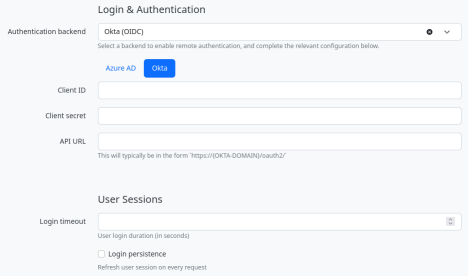
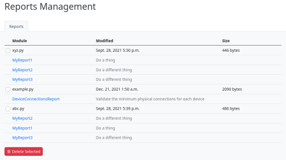
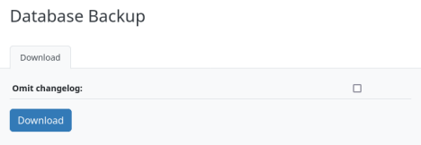

# Getting Started

This document will help you get up and running with NetBox Cloud quickly. It highlights all the unique features provided by NetBox Cloud.

## About NetBox Cloud
NetBox Cloud is a managed deployment of the open source NetBox application, extended to improve user experience and maintained by NetBox Labs. NetBox Cloud provides all the power of NetBox without the burden of installation and long-term maintenance.

## NetBox Cloud Features
All the NetBox Cloud features within the user interface (UI) are found under the "Cloud" heading of the navigation menu:

 

## NetBox Configuration
NetBox supports many configuration parameters that affect how it functions. There are two areas of the UI in which these parameters can be adjusted.

### Administrative Configuration
The first area is under the administrative interface. To access this interface, you must be logged into NetBox as a user with administrator privileges. Navigate to the admin UI by expanding the user menu at top right and clicking the "Admin" link. Then, navigate to `Extras > Config revisions > Add`.

 

This form will allow you to set various configuration parameters. Once the desired configurations have been made, you may optionally provide a comment as to why the changes were made, and click the "Save" button. This will create a new revision of NetBox's configuration.

Configuration changes made via the admin UI take effect immediately. If you would like to revert your changes at any point, you can do so within the admin UI by locating the desired previous revision and clicking the "Restore" button to its right.

### NetBox Cloud Configuration
You may notice that some configuration parameters are not present from the configuration form in the admin UI. This is because these are not supported by NetBox as dynamic configuration parameters: They can be modified only by altering NetBox's configuration file. Such settings include:
- User authentication (including SSO)
- Enabling & configuring plugins
- Time & date formatting

NetBox Cloud exposes these configuration parameters through its own interface, which can be reached by navigating to `Cloud > Administration > Configuration`.

 

Once the desired configuration parameters have been set, click the "Save & Restart" button. Note that the application of these changes does require a restart of some NetBox Cloud services, and access to the NetBox Cloud UI and API may be interrupted briefly.

### Single Sign-On (SSO)
NetBox Cloud currently supports single sign-on (SSO) authentication for the following providers:

- Microsoft Azure AD
- Okta (via OpenID Connect)

We are implementing support for additional backends as well as customers request them. If you have a need for a specific authentication backend, please let us know.

To enable SSO, select the desired backend and provide the required configuration parameters under the appropriate tab. For information on configuring your specific backend service, you can consult the [SSO configuration guides](https://docs.netbox.dev/en/stable/administration/authentication/overview/) in the NetBox documentation, or contact NS1 for assistance.

### Plugins
NetBox plugins can be enabled and configured under the NetBox Cloud configuration interface. Select the plugins you wish to enable from the list, and optionally provide any desired plugin
configuration data. (This should be a JSON data structure equivalent to what you would define for NetBox's [PLUGINS_CONFIG](https://docs.netbox.dev/en/stable/plugins/) parameter.)

We continually evaluate new NetBox plugins for inclusion in NetBox Cloud, and plan to offer custom plugin support in the near future. Please let us know if you'd like to propose a new plugin for inclusion.

### Custom Scripts Management
Custom scripts are a NetBox extension that enables users to write custom Python scripts to perform tasks within NetBox and execute them directly within the NetBox UI. Custom scripts can be uploaded to NetBox Cloud and managed via this control panel.

To upload a custom script, select the desired Python file and click the "Upload" button. Note that any existing files will not be overwritten unless the "overwrite" checkbox has been checked. Once uploaded, these files will appear in NetBox under `Other > Integrations > Scripts`.

To delete a custom script, select the desired file(s) from the table and click the "Delete" button.

### Reports Management
Like custom scripts, reports are custom Python scripts that can be executed from the NetBox UI. Reports are intended to evaluate and report on the condition of objects within NetBox. For example, you might write a report to verify that every device has a primary IP address assigned to it.

To upload a report, select the desired Python file and click the "Upload" button. Note that any existing files will not be overwritten unless the "overwrite" checkbox has been checked. Once uploaded, these files will appear in NetBox under `Other > Integrations > Reports`.

To delete a report, select the desired file(s) from the table and click the "Delete" button.

### Database Backup
NetBox Cloud administrators can download a complete copy of their active database at any time. To do so, navigate to `Cloud > Administration > Database Backup`.

You may optionally omit the changelog, which can comprise a large amount of data, if not desired. Click the "Download" button to perform a SQL dump, which will be returned as a downloadable .sql file.
